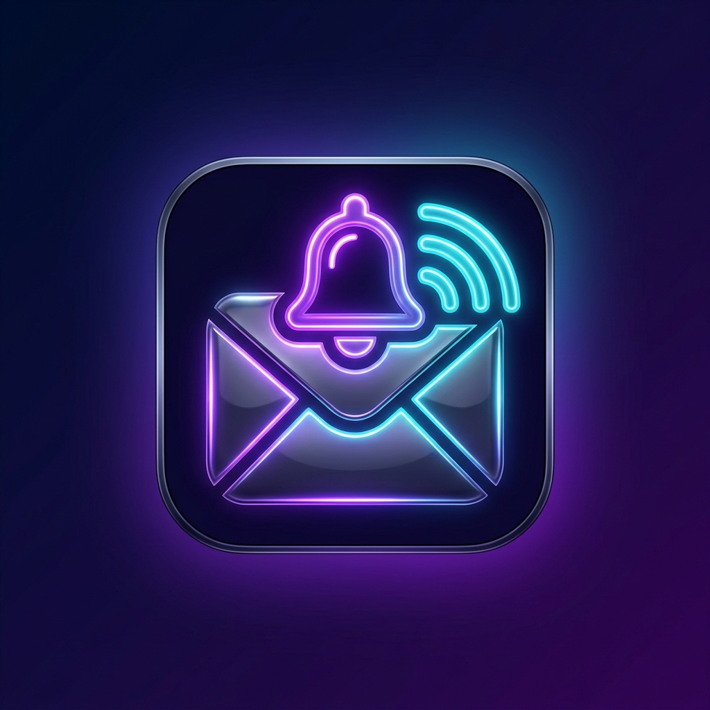

<div align="center">
  
  <h1>📱 SMS Note</h1>
  <p><b>Ultra-Lightweight Android SMS & Notification Forwarder with Real-Time Web Dashboard</b></p>

  <p>
    
    
    
    
  </p>
</div>

---

## 🌟 Overview

**SMS Note** is an ultra-lightweight (~2.50 MB) background automation app for Android that captures incoming SIM SMS and system notifications, seamlessly forwarding them in real-time to your **Telegram Bot**, **Supabase Cloud Database**, or **Custom Email Webhooks**.

It comes with a built-in **Live Web Dashboard** (`index.html`), offline SQLite caching, automatic network retry logic, and Android 8.0+ Doze Mode / Power Saver resilience.

---

## ✨ Features

- ⚡ **Ultra-Tiny Footprint**: Compiled Native Kotlin code (1.8 MB APK) with zero heavy UI framework overhead.
- 📲 **SIM SMS Interception**: Captures incoming SIM messages instantly via native `SMS_RECEIVED` broadcast receivers.
- 🔔 **App Notification Listener**: Intercepts app notifications (WhatsApp, Telegram, System, Banking alerts) using `NotificationListenerService`.
- ✈️ **Telegram Bot Forwarding**: Direct instant transmission to your personal Telegram Bot channel via Telegram Bot API.
- ⚡ **Supabase Real-Time Cloud Storage**: Automatically syncs messages to a Supabase Postgres table.
- 💾 **Offline SQLite Queue & Auto-Retry**: If the phone is offline or loses network coverage, messages are safely queued locally in SQLite and flushed automatically once internet connection is restored.
- 🔋 **Power Saving & Doze Mode Support**: Background service stays alive even under Android 8+ battery saver mode.
- 📊 **Live Web Dashboard (`index.html`)**: Beautiful dark-mode dashboard with real-time polling, search filters, 7-day data retention, and 1-click copy.

---

## 🔑 How to Get All Credentials & Keys

### 1. Telegram Bot Token & Chat ID
- **Telegram Bot Token**:
  1. Open Telegram and search for `@BotFather`.
  2. Send `/newbot` and follow instructions to give your bot a name and username.
  3. `@BotFather` will give you your **HTTP API Bot Token** (e.g., `123456789:ABCdefGhIJKlmNoPQ...`).
- **Telegram Chat ID (Whose ID?)**:
  - **Personal Messages**: Search for `@userinfobot` on Telegram and click `Start`. It will reply with **your personal Telegram User ID** (e.g., `987654321`).
  - **Group or Channel**: Add your newly created bot as an Admin into your Telegram Group/Channel, then use the Group/Channel Chat ID (starts with `-100...`).

---

### 2. Supabase Credentials & Table Setup
- **Supabase URL & Anon Key**:
  1. Go to your [Supabase Dashboard](https://supabase.com/dashboard) project.
  2. Go to **Settings (⚙️)** -> **API** (or **Data API**).
  3. Copy your **Project URL** (e.g., `https://xyz.supabase.co`).
  4. Under **Project API keys**, copy the **`anon` `public`** key.
- **Database Table Setup**:
  Open the **SQL Editor** (`>_`) in Supabase and run:
  ```sql
  create table notifications (
    id bigint generated by default as identity primary key,
    source text,
    sender text,
    content text,
    created_at bigint
  );
  ```

---

### 3. Email / Webhook URL (100% Free Google Apps Script Method)
- **Direct Free Gmail Forwarding (3,000 emails/month)**:
  1. Open [script.google.com](https://script.google.com) and create a **New Project**.
  2. Replace the editor code with:
     ```javascript
     function doPost(e) {
       try {
         var data = JSON.parse(e.postData.contents);
         var source = data.source || "SMS Note";
         var sender = data.sender || "Unknown";
         var content = data.content || "";
         
         var emailRecipient = "YOUR_EMAIL@gmail.com"; // Your target Gmail
         var subject = "📱 [" + source + "] From: " + sender;
         var body = "Source: " + source + "\nFrom: " + sender + "\n\nMessage:\n" + content;
         
         MailApp.sendEmail(emailRecipient, subject, body);
         return ContentService.createTextOutput("OK");
       } catch (err) {
         return ContentService.createTextOutput("Error: " + err.toString());
       }
     }
     ```
  3. Click **Save (💾)** ➔ **Deploy** ➔ **New deployment**.
  4. Select type **Web app**, set **Who has access** to **Anyone**, and click **Deploy**.
  5. Copy the generated **Web App URL** and paste it into the **`Webhook URL`** box in the Android app or Web Dashboard.

- **Alternative (Make.com)**: Create a Webhook scenario connecting to Gmail (1,000 operations/month).
- **For Testing**: Use [Webhook.site](https://webhook.site) for instant live payload inspection.

---

## 🔒 Credentials & Filter Mode Features

- **🔒 Compact Saved Credentials**: Once configuration is saved, input fields collapse into a small, key-locked summary card. Credentials cannot be modified without clicking **`✏️ Edit Credentials`**.
- **🎛️ 3 Message Filter Modes**:
  - **All (SMS & Notifications)**: Forwards all captured messages.      
  - **Specific SMS & App Notification**: Select **All** then choose **sms filter** and type down your senders name and for app select app and save it
  - **Only SIM SMS**: Forwards only incoming SIM SMS messages.
  - **Notification**: Forwards only app notifications.

---

## 🚀 Quick Installation & Setup

1. Download **`SMS.Note.v1.0.0.apk`** from [GitHub Releases](../../releases).
2. Install on Android device.
3. Launch **SMS Note** and fill in your keys.
4. Click **SAVE CONFIGURATION** (collapses into compact locked view).
5. Select your desired **Message Forwarding Filter Mode** (All, Only SIM SMS, or Notification).
6. Grant **SMS Permissions**, **Notification Access**, and **Allow Background Running** (Disable Battery Saver restrictions).

---

## 📊 Live Web Dashboard (`index.html`)

Double-click [`index.html`](index.html) or run a local server:

```bash
python -m http.server 8080
```
Then open `http://localhost:8080` to track all captured SMS & notifications live with automatic 7-day data retention, compact credential management, and real-time filter tabs!

---

## 📄 License

This project is released under the **MIT License**.

